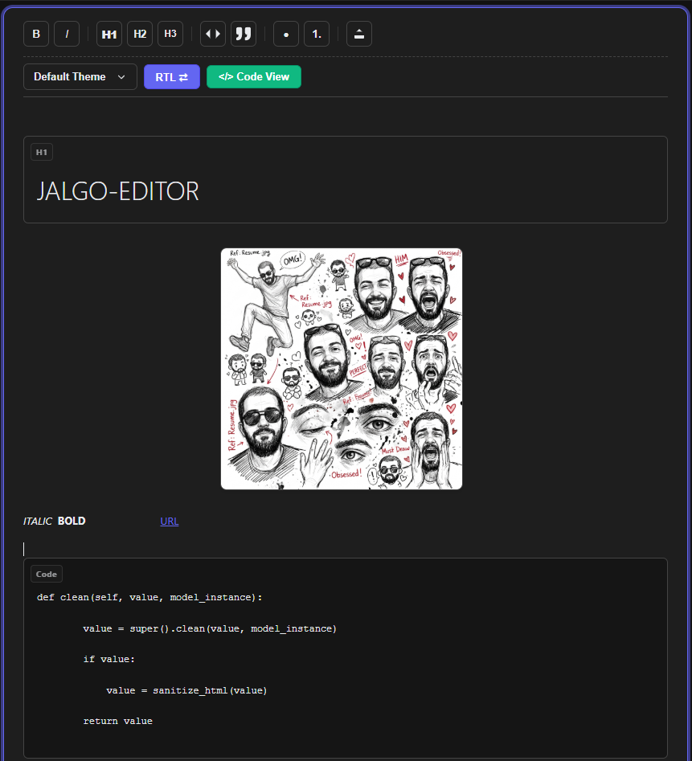
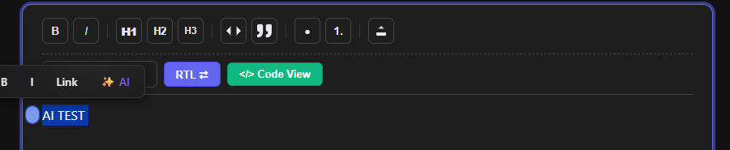

# Jalgo-editor

A zero-dependency, CSP-strict, bidirectional rich-text editor that feels like Notion but lives natively inside the Django Admin.

## Why Jalgo?

Right now, if a Django developer wants a rich-text editor, they have to compromise:
*   **CKEditor / TinyMCE**: Bloated, and fails strict Content Security Policies (CSP) because they inject `style="..."` everywhere.
*   **Editor.js**: Block-based, making mixed-language typing (Persian and English in the same article) a frustrating experience.
*   **Tiptap/ProseMirror**: Requires NPM, React/Vue, and complex build pipelines.

**Jalgo-editor** is the anti-bloat editor. It is a pure Python and Vanilla JavaScript package that drops into any Django project instantly. **No NPM, no build steps, no external CSS frameworks required.**

## Killer Features

1.  **Smart Bi-Directional (Bidi) Engine**: Users don't click an "RTL" or "LTR" button for every block. The editor automatically detects the language of every new paragraph natively applying `dir="rtl"` to Persian/Arabic blocks, and `dir="ltr"` to English. Plus, a global RTL/LTR toggle lets you flip the entire editor's base direction instantly.
2.  **Bank-Grade Security (Double Sanitization)**: 100% CSP compliant with zero inline styles by default. A rigorous backend Python parser provides defense-in-depth Stored XSS protection. Safely handles Base64 image embedding while aggressively stripping malicious data URIs.
3.  **The "Zen" Interface & Block UI**: Notion-like Bubble Menus, fully keyboard-navigable Slash Commands (`/`), and a beautiful premium glassmorphism design. Headings, Quotes, and Code Blocks feature beautiful, distinct "Boxed UI" layouts with floating badges so you always know what block you are editing.
4.  **Dynamic Themes**: Instantly switch between multiple themes including Default, Dark, Retro, and an 8-Bit pixel aesthetic using a custom-built, sleek dropdown selector. Themes dynamically update syntax highlighting colors and UI accents.
5.  **Live Syntax Highlighting**: A lightweight, zero-dependency generic syntax highlighter automatically colorizes programming languages (keywords, strings, comments) in `<pre>` code blocks as you type.
6.  **Unrestricted HTML Code View (Base64-Free)**: A rock-solid, fully editable dark-mode `<textarea>` for raw HTML tweaking. Huge Base64 image strings are intelligently swapped for clean placeholders while editing HTML, keeping your source code beautiful and snappy. We bypass restrictive frontend DOM sanitizers in this view, trusting developers to inject custom classes and tags, deferring final sanitization to the backend.
7.  **Seamless Admin Integration**: Automatically initializes in Django Admin, fully supporting dynamic Inline Formsets without any configuration.
8.  **Drag & Drop Images with Dynamic Alt Text**: Works out-of-the-box using local Base64 embedding with secure validation. Features a sleek, inline floating input field to instantly add and edit SEO-friendly `alt` text right from the image's bubble menu.

## Installation

Install using pip:

```bash
pip install jalgo-editor
```

Add to your `INSTALLED_APPS` in `settings.py`:

```python
INSTALLED_APPS = [
    # ...
    "jalgo_editor",
]
```

## Usage

Simply swap your standard `models.TextField` with `FluidTextField`:

```python
from django.db import models
from jalgo_editor.fields import FluidTextField

class Article(models.Model):
    title = models.CharField(max_length=200)
    content = FluidTextField() # Automatically renders the Notion-style editor
```

No widget configuration needed! It will seamlessly appear in your Django Admin with beautiful Glassmorphism styling and dark-mode support.

### Displaying Content

To securely render the stored HTML in your frontend templates, use Django's `safe` filter. We highly recommend including the editor's CSS file and wrapping your content in the `.jalgo-content` class. This provides a premium, modern, and minimal dark-themed typography design out-of-the-box (including styled headers, quotes, lists, and syntax-highlighted code blocks):

```html

<!DOCTYPE html>
<html>
<head>
    <!-- Include the editor CSS to load the beautiful frontend typography -->
    <link rel="stylesheet" href="">
</head>
<!-- Add a dark background to your body to match the styling -->
<body class="dark-background">
    <!-- Wrap your content in jalgo-content -->
    <div class="jalgo-content">
        {{ article.content|safe }}
    </div>
</body>
</html>
```

### Using with Docker

Because `jalgo-editor` is pure Python/JS and has zero external build dependencies, using it in a Dockerized Django project is extremely simple. Just add it to your `requirements.txt`:

```text
jalgo-editor>=1.0.1
```

Then in your `Dockerfile`:

```dockerfile
RUN pip install -r requirements.txt
```

*Note: Ensure you run `python manage.py collectstatic` during your deployment pipeline so the editor's static files are correctly served by your web server (e.g., Nginx, WhiteNoise).*

## Monetizable Extensions (Premium API)

Jalgo-editor includes configuration hooks for premium integrations:
*   `JALGO_AI_LICENSE_KEY`: Unlocks the `/ai` autocomplete translation and phrasing engine inside the bubble menu.
*   `JALGO_CDN_TOKEN`: Bypasses your local media storage to automatically drag-and-drop upload and WebP-optimize images to the Jalgo CDN.

## License
MIT License



